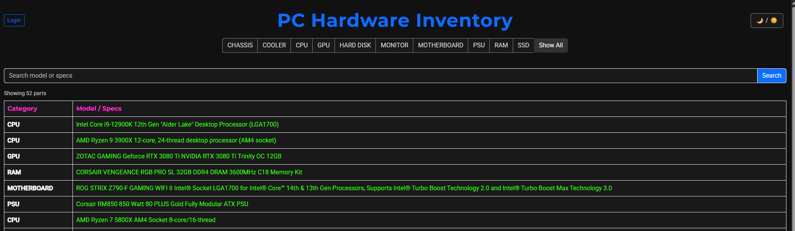
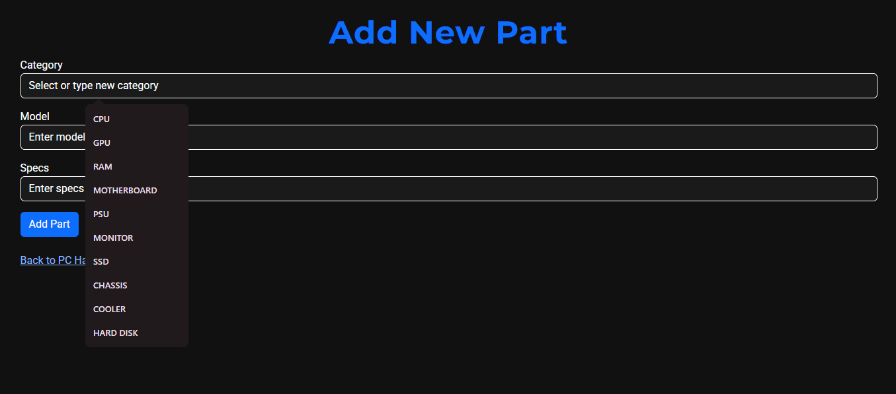
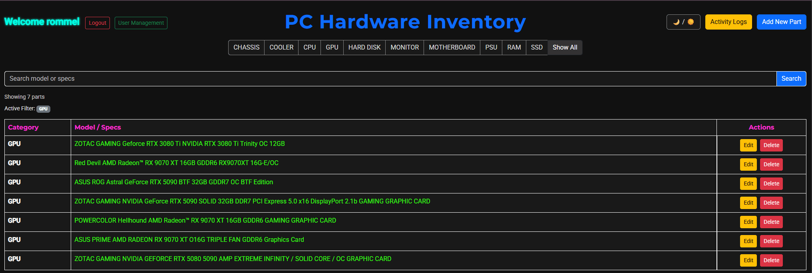
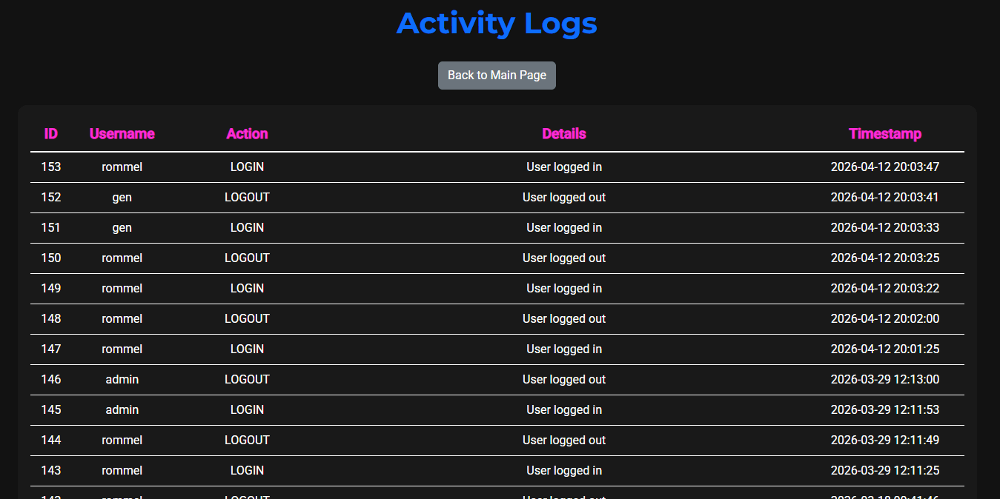

# 📦 Parts Management Web App


A simple Parts Management System built with Flask, MySQL, and Docker.
This project allows an admin to manage users, parts inventory, and perform role-based operations while tracking all activity logs.

## 🚀 Features
User Management
- Admin can create, delete, and update users
- Admin can reset passwords
- Role-based access: admin, editor, viewer
- Admin cannot delete their own account (prevention for accidental lock-out)

Parts Management
- Add, edit, delete parts(admin only)
- Editors can edit parts
- Viewers can only view parts
- Filter and search parts by category or keyword

Activity Logs
- Tracks all user and parts-related actions:
    - User login/logout
    - Part add/edit/delete
    - User creation, deletion, role changes, and password resets
- Logs are viewable on the Activity Logs page (admin only)
- Table theme syncs with the rest of the app and uses color-coded headers

Security
- Passwords are stored hashed using werkzeug.security.generate_password_hash 
- Role-based page access
- Session management with Flask session

## ⚙️ Tech Stack
- Backend: Flask
- Database: MySQL 8
- Containerization: Docker & Docker Compose
- Frontend: Bootstrap 5
- Password Security: Werkzeug hash (scrypt/pbkdf2)

## 🌐 Project Structure

```text
computer-parts-service/
|-------app/                        # Flask app
|        |----app.py                # Flask app routes & logic
|        |----create_db.py
|        |----Dockerfile
|        |----pc_parts.db
|        |----templates/            # HTML templates
|              |----index.html
|              |----add_part.html
|              |----edit_part.html
|              |----users.html
|              |----edit_user.html
|              |----activity_logs.html
|-------nginx/                      # Nginx config
|        |----Dockerfile
|        |----nginx.conf
|-------docker-compose.yml          # Docker Compose file
|-------init.sql                    # Initial MySQL setup & hashed admin password
|-------README.md
|-------images/                     # Screenshots
|-------requirements.txt
```
## 🔩 Requirements
- Docker
- Docker Compose
- Web browser (Chrome, Firefox, etc.)

## 🛡️ Security Notes
1.	Passwords are hashed in the database
2.	Changing the admin password does not require updating init.sql
3.	Sessions are protected with a secret key in app.py

## 🛠️ Usage
- Admin Panel
    - Access via User Management button (admin only)
    - Add, edit, delete users
    - Reset user passwords
    - Safety features implemented for user deletion
- Parts Management
    - Add, edit, delete parts (based on role)
    - Filter and search parts by category or keyword
- Safety features prevent accidental deletion of the admin account

## 📝 Activity Logs
- Accessible from the Activity Logs button (admin only)
- Displays a full history of user and parts actions with timestamps
- Table theme and colors match the rest of the app for consistency

## ☀️🌙 Dark Theme
- Dark theme syncs across all pages
- Toggle available from the main page

## 🏗️ Future Improvements
- Enhance form validations
- Add export/import for parts data (CSV/Excel)
- Add REST API endpoints
- Customizable color schemes for activity log entries

## 🐳 Setup Instruction

1. Clone the repository:
``` bash
    git clone https://github.com/raketqueen/Computer-Parts-Service-Role-Based-Access.git
    cd ~/Computer-Parts-Service-Role-Based-Access
```
 
2. Build the Docker containers:
``` bash
    docker compose up --build
```

3. Post Docker Compose build:   
	- Web app will be accessible at http://localhost:8080
	- MySQL is available internally on port 3306, mapped to host 3307

4.	Initial Admin Account
    - Username: admin
    - Password: admin123 (hashed in init.sql)
    - Only the admin can create users and manage roles

5. Stop Containers:
``` bash
    docker compose down
```

## Author
- Rommel Asis – Original Developer

## 📸 Screenshot



